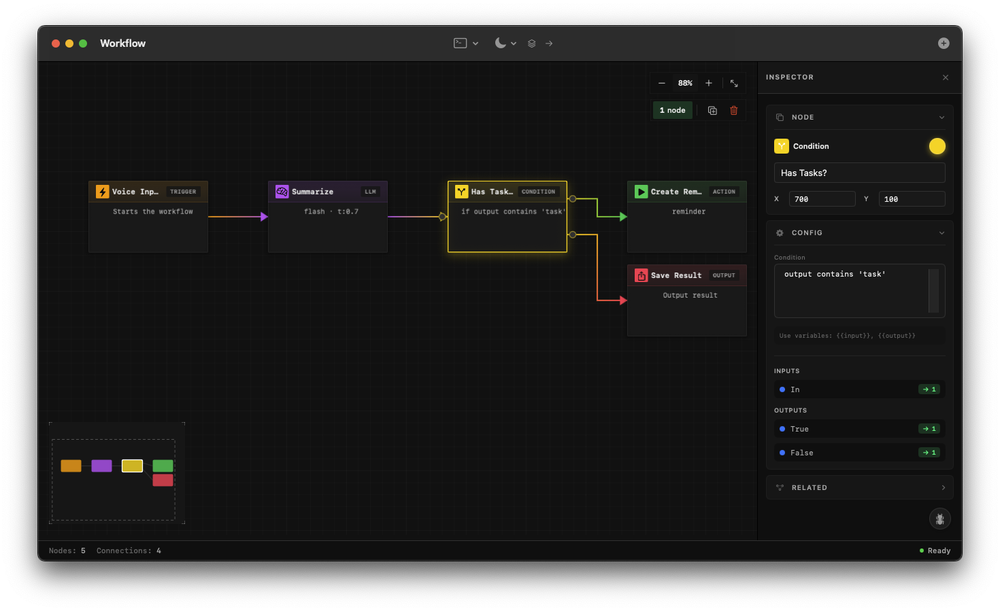

# WFKit

A beautiful, native macOS workflow editor component built with SwiftUI.


<p align="center">
  
</p>

## Features

- **Node-based Editor** - Drag-and-drop workflow canvas with pan, zoom, and grid snapping
- **Rich Node Types** - Trigger, LLM, Transform, Condition, Action, and Output nodes
- **Smart Connections** - Bezier curve connections with validation and snap-to-port
- **Unified Theming** - Dark/Light/System appearance with consistent styling
- **Custom UI Components** - Themed context menus, popovers, and pickers
- **Inspector Panel** - Property editing with collapsible sections
- **Minimap Navigation** - Quick overview and click-to-navigate
- **Keyboard Shortcuts** - Full keyboard support for power users
- **Undo/Redo** - Complete history stack with snapshots

## Quick Start

```swift
import SwiftUI
import WFKit

@main
struct MyApp: App {
    @State private var canvasState = CanvasState()
    @State private var themeManager = WFThemeManager()

    var body: some Scene {
        WindowGroup {
            WFWorkflowEditor(state: canvasState)
                .environment(\.wfTheme, themeManager)
        }
    }
}
```

## Architecture

```
Sources/
├── WFKit/                    # The library
│   ├── Models/               # Data models
│   │   ├── WorkflowNode.swift
│   │   ├── WorkflowConnection.swift
│   │   └── CanvasState.swift
│   ├── Canvas/               # Canvas components
│   │   ├── WorkflowCanvas.swift
│   │   ├── NodeView.swift
│   │   ├── ConnectionView.swift
│   │   └── MinimapView.swift
│   ├── Inspector/            # Property inspector
│   │   └── InspectorView.swift
│   ├── Toolbar/              # Toolbar
│   │   └── ToolbarView.swift
│   ├── Components/           # Reusable UI components
│   │   └── WFContextMenu.swift
│   ├── Theme/                # Theming system
│   │   └── WFTheme.swift
│   └── WFWorkflowEditor.swift  # Main entry point
│
└── WorkflowApp/              # Demo application
    └── WorkflowApp.swift
```

## Development

```bash
# Build and run
./dev.sh

# Just run (no build)
./run.sh

# Or manually
swift build
swift run Workflow
```

## Keyboard Shortcuts

| Shortcut | Action |
|----------|--------|
| `⌘C` | Copy selected nodes |
| `⌘V` | Paste nodes |
| `⌘D` | Duplicate selected |
| `⌘A` | Select all |
| `⌘Z` | Undo |
| `⇧⌘Z` | Redo |
| `Delete` | Delete selected |
| `Space` | Pan mode (hold) |
| `Arrow keys` | Nudge selected nodes |
| `⇧Arrow` | Fine nudge (1px) |
| `⌘Arrow` | Large nudge (100px) |
| `Tab` | Select next node |
| `⇧Tab` | Select previous node |
| `Escape` | Clear selection |

## Theming

WFKit uses a unified theming system. Access theme colors via the environment:

```swift
@Environment(\.wfTheme) private var theme

// Use theme colors
theme.canvasBackground
theme.nodeBackground
theme.textPrimary
theme.accent
```

Switch appearance programmatically:

```swift
theme.appearance = .dark   // .dark, .light, or .system
```

## Node Types

| Type | Icon | Purpose |
|------|------|---------|
| Trigger | ⚡ | Workflow entry point |
| LLM | 🧠 | AI/Language model processing |
| Transform | ✨ | Data transformation |
| Condition | 🔀 | Conditional branching |
| Action | ▶️ | Execute actions |
| Output | 📤 | Workflow output |

## License

MIT
