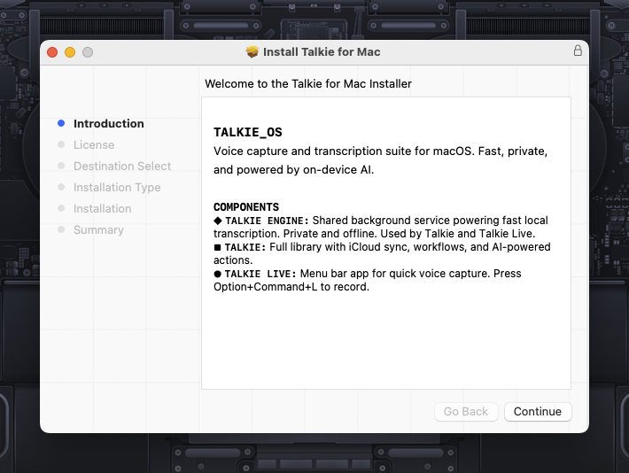

# Talkie Installer Build System


<p align="center">
  
</p>

Build, sign, and notarize the unified macOS DMG for Talkie.

## Prerequisites

- Xcode Command Line Tools
- Developer ID Application certificate matching `TALKIE_DEVELOPER_ID_APP`
- Developer ID Installer certificate if you use the package release flow
- Notarization credentials stored via `xcrun notarytool store-credentials`
- Private signing env file based on `../../Config/signing.env.example`

## Usage

```bash
cp ../../Config/signing.env.example /path/to/private/talkie-signing.env
$EDITOR /path/to/private/talkie-signing.env
TALKIE_SIGNING_ENV_FILE=/path/to/private/talkie-signing.env ./build.sh --version 1.3.0
```

## Environment Variables

```bash
VERSION=1.3.0 ./build.sh            # Set version
SKIP_NOTARIZE=1 ./build.sh          # Skip notarization for testing
TALKIE_SIGNING_ENV_FILE=... ./build.sh
```

Required signing identifiers:

- `TALKIE_TEAM_ID`
- `TALKIE_DEVELOPER_ID_APP`
- `TALKIE_MAC_CORE_BUNDLE_ID`
- `TALKIE_MAC_AGENT_BUNDLE_ID`
- `TALKIE_MAC_SYNC_BUNDLE_ID`
- `TALKIE_MAC_CORE_PROFILE_NAME`
- `TALKIE_MAC_SYNC_PROFILE_NAME`

Optional:

- `TALKIE_NOTARY_PROFILE`
- `TALKIE_EXPORT_OPTIONS_CORE_TEMPLATE`
- `TALKIE_EXPORT_OPTIONS_PROVISIONED_TEMPLATE`

## Targets

| Artifact | Output | Contents |
|----------|--------|----------|
| Unified DMG | `Talkie-for-Mac.dmg` | Talkie app with embedded TalkieAgent + TalkieSync login items |

## What the Script Does

1. Verifies signing certificates exist
2. Builds TalkieAgent, TalkieSync, and Talkie from source
3. Signs each embedded app with Developer ID Application certificate
4. Creates a unified `Talkie.app` bundle
5. Builds a signed DMG
6. Submits for Apple notarization and waits for approval
7. Staples notarization ticket to the DMG
8. Verifies Gatekeeper acceptance

## Output

Signed and notarized DMGs are created in the `packaging/macos/` directory:
- `Talkie-for-Mac.dmg`

## Testing Installation

```bash
open 'Talkie-for-Mac.dmg'
```

## Troubleshooting

Check notarization status:
```bash
xcrun notarytool history --keychain-profile notarytool
xcrun notarytool log <submission-id> --keychain-profile notarytool
```

Verify package signature:
```bash
codesign --verify --deep --strict Talkie-for-Mac.dmg
spctl --assess --type open Talkie-for-Mac.dmg
```
